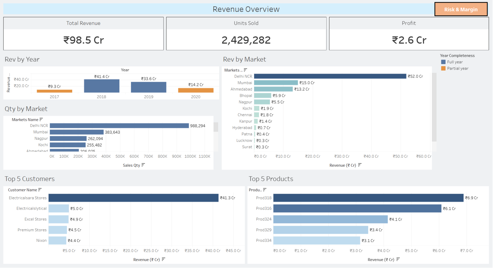
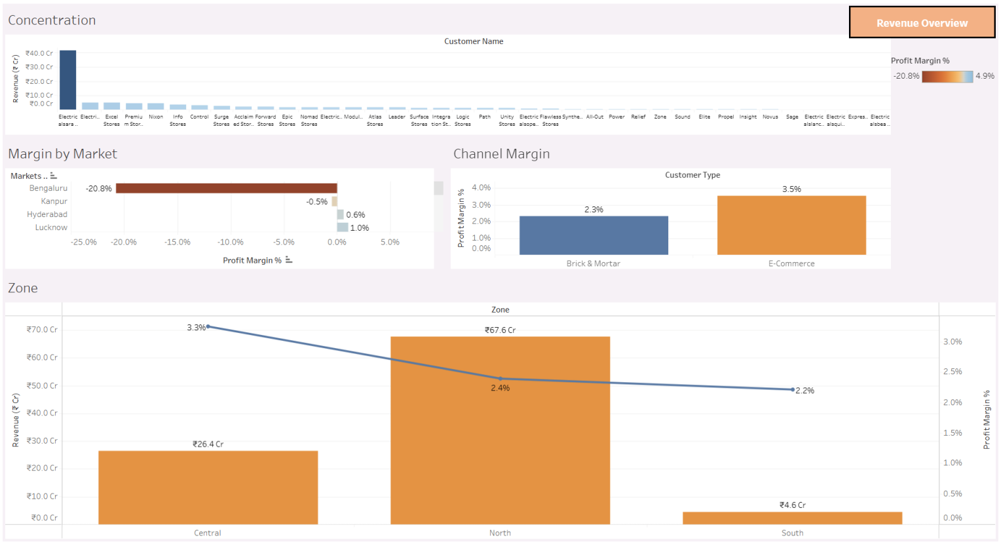
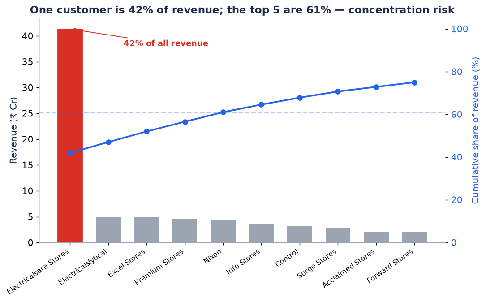
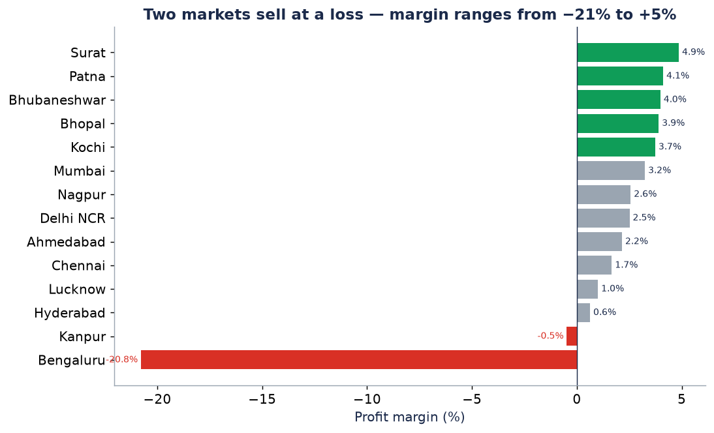
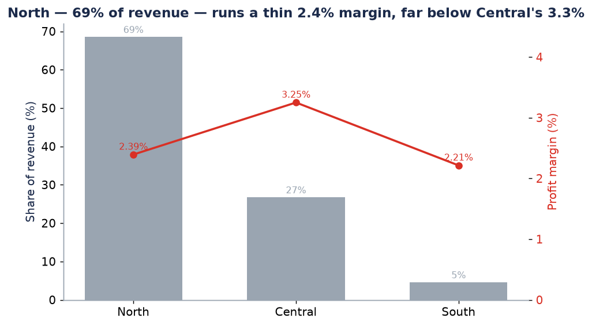
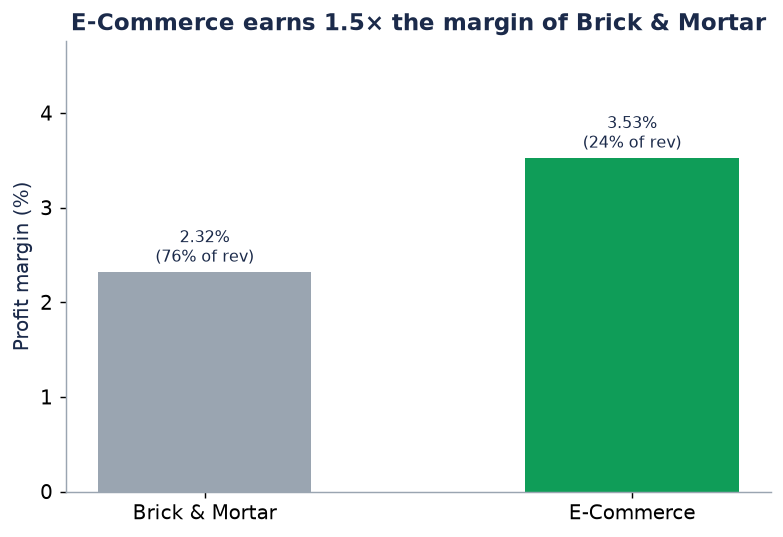
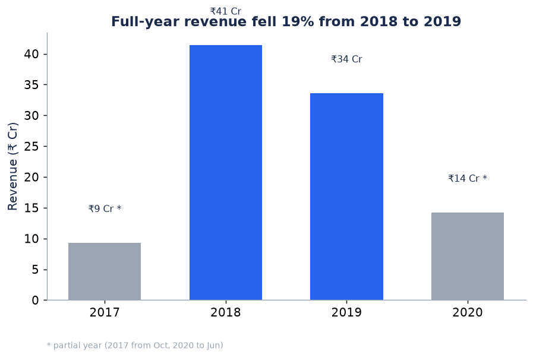

# AtliQ Sales: a ₹98 Cr business resting on one customer

> Finding the risk a revenue dashboard hides — single-account dependency, loss-making markets, and a shrinking, low-margin book — and the decisions that fix it.

<div align="center">


[](https://public.tableau.com/app/profile/thrivikrama.rao.kavuri6778/viz/AtliQ-Sales-Insights/RevenueOverview)
[](LICENSE)

</div>

---

## 🎯 TL;DR — read this in 20 seconds

- **The problem:** AtliQ Hardware's leadership tracks *revenue*, which looks healthy at **₹98 Cr** — so no one is managing the risks underneath it.
- **The finding:** **42% of all revenue comes from a single customer** (top 5 = **61%**), the company nets just a **2.6% margin** with **two markets selling at a loss** (Bengaluru **−20.8%**), and full-year revenue **fell 19%** (2018→2019).
- **The recommendation:** treat customer diversification as a board-level risk, re-price/exit the loss-making markets, and shift volume to the **E-Commerce** channel that already earns **1.5× the margin** — worth an estimated **~₹1 Cr/yr in recoverable profit** on existing revenue, before counting the de-risking.
- **See it:** [Live Tableau dashboard](https://public.tableau.com/app/profile/thrivikrama.rao.kavuri6778/viz/AtliQ-Sales-Insights/RevenueOverview) · [Analysis notebook](notebooks/01_analysis.ipynb) · [SQL](sql/analysis.sql) · [Tableau workbook](dashboard/sales-insights.twbx)

---

## 📊 The dashboard

Two interactive Tableau dashboards — **Revenue Overview** and **Risk & Margin** — turn the analysis into something a stakeholder can self-serve. Both are built on the **same cleaned data** (`data/processed/transactions_clean.csv`), so every figure matches the findings above.

**Revenue Overview** — headline KPIs, where revenue and units come from, and the trend:


**Risk & Margin** — concentration, loss-making markets, the channel gap, and the regional-margin story:


> 🛠️ Built in Tableau on `data/processed/transactions_clean.csv` — explore the [**live Tableau Public dashboard**](https://public.tableau.com/app/profile/thrivikrama.rao.kavuri6778/viz/AtliQ-Sales-Insights/RevenueOverview), open [`dashboard/sales-insights.twbx`](dashboard/sales-insights.twbx), or follow the [**Tableau build guide**](dashboard/TABLEAU_BUILD_GUIDE.md) (calculated fields, worksheet recipes, layout, QA targets) to reproduce it.

---

## 🧩 The Problem

AtliQ Hardware is a fast-growing computer-hardware distributor across India. The sales director gets regional numbers as ad-hoc Excel files and tracks one thing: **is revenue going up?** That single lens is dangerous. Topline growth can mask a business that is **fragile** (over-reliant on one buyer), **unprofitable in places** (selling below cost in some cities), and **mixing toward its worst-margin segments**. The decision blocked without this analysis: *where should the sales organisation actually focus to protect profit and reduce risk?*

## ❓ The Questions

1. How concentrated is revenue — what happens if the biggest account leaves?
2. Are all markets profitable, or are some destroying value?
3. Is growth flowing to high-margin or low-margin parts of the business?
4. Which channel (E-Commerce vs Brick & Mortar) should we lean into?

## 📦 The Data

| | |
|---|---|
| **Source** | AtliQ Hardware MySQL dump (`data/raw/db_dump.sql`) + Excel copy |
| **Grain** | One product sold to one customer in one market on one date |
| **Volume** | **148,395** transactions · **38** customers · **17** markets · **279** products |
| **Window** | **Oct 2017 → Jun 2020** (2017 & 2020 are partial years) |
| **Model** | Star schema — `transactions` fact + `customers`, `markets`, `products`, `date` dims |

**Honest limitations:** the dump is already clean (no non-positive amounts; only 2 USD rows), so this is a *decision* showcase, not a data-cleaning one. Margins are as-booked — overhead/logistics allocation is out of scope and would only deepen the loss-making-market conclusion.

## 🔍 Approach — and why each choice

1. **Reproducible load over manual import.** `src/data_loader.py` parses the SQL dump directly into pandas and applies the same cleaning rules encoded in [`sql/etl_clean.sql`](sql/etl_clean.sql) — so the Python and SQL paths agree and anyone can reproduce without standing up MySQL.
2. **Normalise to INR, drop non-sales.** Trim stray currency text, convert the handful of USD rows, and exclude `sales_amount ≤ 0`. Documented constants, not silent magic.
3. **Rank by *margin* and *concentration*, not revenue.** A revenue ranking would have repeated what leadership already sees. Ranking by margin and cumulative customer share is the deliberate lens that surfaced the real risks.
4. **End every finding in a decision.** Each chart below closes with "so we should…", because an analysis that stops at a chart isn't finished.

## 📊 Key Findings

### 1. One customer is 42% of revenue — a single point of failure

**_Electricalsara Stores alone is 42% of revenue; the top 5 are 61%. Losing the top account would erase nearly half the business — diversification is a board-level risk, not a sales nicety._**

### 2. Two markets sell at a loss

**_Bengaluru (−20.8%) and Kanpur (−0.5%) lose money on every sale. Re-price or exit them before chasing new growth — each incremental order there makes the P&L worse._**

### 3. Growth is concentrated in a low-margin region

**_The North zone is ~69% of revenue but earns just 2.4% margin — far below Central's 3.3%. AtliQ's scale sits in its least-profitable major region; tilt sales incentives toward Central, where the same effort returns more profit per rupee._**

### 4. E-Commerce earns 1.5× the margin — but is under-weighted

**_E-Commerce nets 3.5% vs Brick & Mortar's 2.3%, yet is only ~24% of revenue. Moving marginal volume online lifts profit on revenue the business already has._**

### 5. Revenue is shrinking

**_Comparing the two complete years, revenue fell 19% (2018→2019). The fixes above aren't polish — they're how a shrinking, low-margin book is stabilised._**

## 🧠 Why this solution is optimal

- **Concentration via cumulative share, not a top-5 list.** A "top customers" table looks healthy; the **cumulative-share** view (a window function in [`sql/analysis.sql`](sql/analysis.sql)) is what makes the 42%/61% dependency unmissable.
- **Margin ranking over revenue ranking.** Sorting markets by margin — not size — is the only view that exposes Bengaluru and Kanpur; a revenue chart buries them near zero.
- **Full-year-only trend.** Excluding partial 2017/2020 avoids the classic fake "decline" that partial periods create — an honest comparison instead of a scary-looking one.
- **SQL *and* Python, kept in sync.** The same logic exists as a MySQL view and as tested Python functions, so the result is auditable from either side and reproducible by a reviewer with neither tool pre-configured.

## 💰 Impact & Recommendations

| Lever | Action | Estimated value |
|---|---|---|
| **Concentration risk** | Diversify away from the 42% account; set an account-share ceiling | De-risks **~₹41 Cr** of revenue exposed to one renewal |
| **Channel mix** | Shift Brick & Mortar volume toward E-Commerce-level margin | **~₹1 Cr/yr** added profit on existing revenue (lifting B&M's ₹74.5 Cr book from 2.3%→3.5%) |
| **Loss-making markets** | Re-price or exit Bengaluru & Kanpur | Stops per-order value destruction; protects blended margin |
| **Regional focus** | Re-weight incentives from North toward Central/South | Higher profit per rupee of the same sales effort |

## 🛠️ Tech Stack

| Tool | Why it's here |
|---|---|
| **MySQL** | Source system + the SQL the analysis is written in (CTEs, window functions) |
| **Python / pandas** | Reproducible ETL + metrics so the numbers regenerate in one command |
| **Matplotlib** | Decisive, captioned figures for the README |
| **Tableau** | Interactive Revenue & Profit dashboards for stakeholders |
| **Jupyter** | The narrated, top-to-bottom analysis |

## ▶️ Reproduce This

```bash
git clone https://github.com/VikramKavuri/atliq-sales-margin-risk.git
cd atliq-sales-margin-risk
pip install -r requirements.txt

# Option A — regenerate every figure + the processed CSV from the raw dump:
python src/build_report.py

# Option B — run the narrated analysis end-to-end:
jupyter nbconvert --to notebook --execute --inplace notebooks/01_analysis.ipynb
```

To explore in **SQL**: load `sql/schema.sql`, `SOURCE data/raw/db_dump.sql`, then run `sql/etl_clean.sql` and `sql/analysis.sql`.
To explore in **Tableau**: open the [live Tableau Public dashboard](https://public.tableau.com/app/profile/thrivikrama.rao.kavuri6778/viz/AtliQ-Sales-Insights/RevenueOverview), open `dashboard/sales-insights.twbx`, or connect to `data/processed/transactions_clean.csv`.

## 📁 Repo Structure

```
atliq-sales-margin-risk/
├── README.md                       # this story
├── requirements.txt                # pinned — reproducibility is non-negotiable
├── data/
│   ├── raw/                        # immutable source: db_dump.sql + .xlsx
│   └── processed/                  # transactions_clean.csv (generated)
├── sql/
│   ├── schema.sql                  # star-schema DDL
│   ├── etl_clean.sql               # cleaning view (mirrors the Python ETL)
│   └── analysis.sql                # the 5 findings, with CTEs + window functions
├── src/
│   ├── data_loader.py              # parse dump → clean, INR-normalised fact table
│   ├── metrics.py                  # one function per finding
│   ├── viz.py                      # captioned figures
│   └── build_report.py             # one-command reproduction
├── notebooks/
│   └── 01_analysis.ipynb           # narrated, runs clean top-to-bottom
├── reports/figures/                # exported charts used above
└── dashboard/                      # Tableau workbook + presentation
```

## 👤 About

**Vikram Kavuri** — [GitHub](https://github.com/VikramKavuri) · [LinkedIn](https://www.linkedin.com/in/thrivikrama-rao-kavuri-7290b6147/)

> Built on the AtliQ Hardware dataset (Codebasics). The dataset is a learning standard; the **risk framing, margin analysis, and reproducible pipeline here are original** and go beyond the original revenue/profit dashboards.
